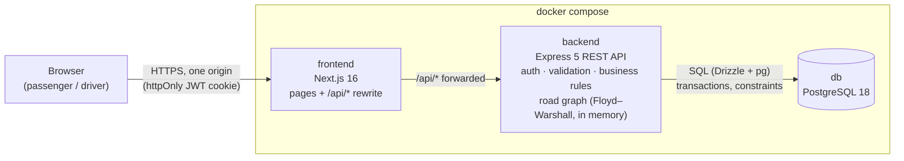
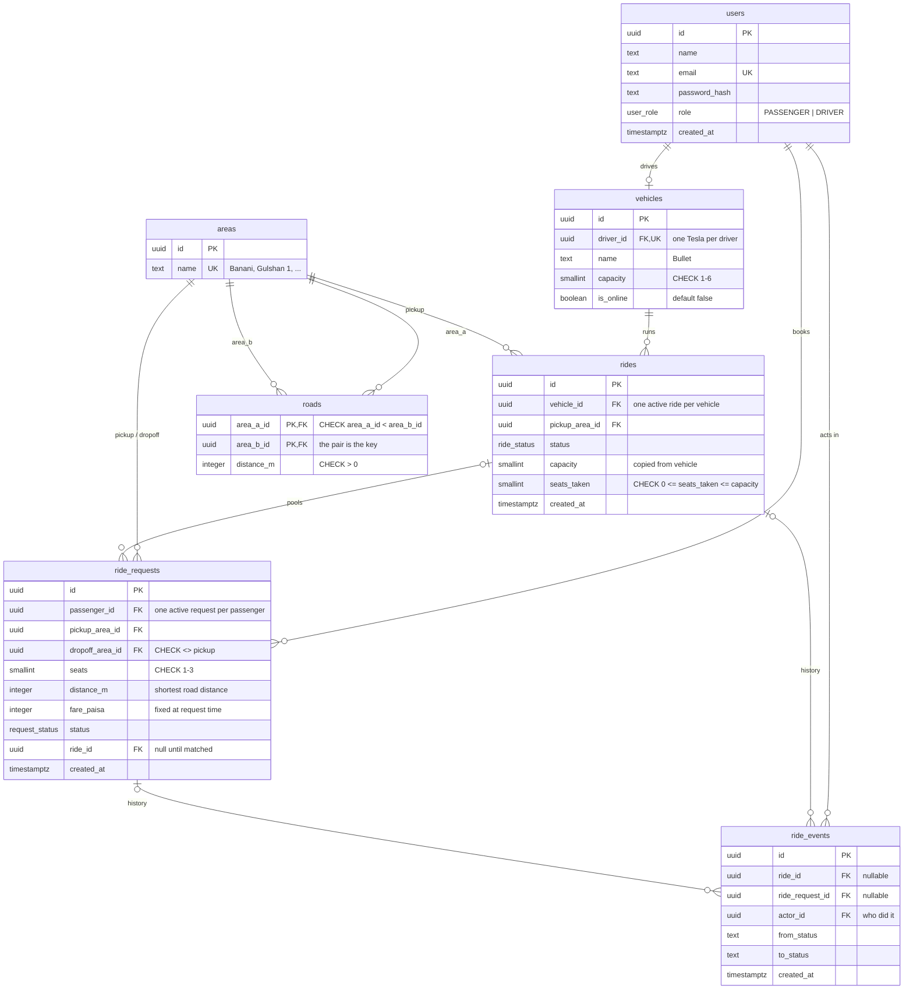

# Architecture

## System

- **One origin for the browser.** The browser only talks to the frontend. Next.js forwards `/api/*` to Express, so the auth cookie is first-party and no CORS is needed.
- **All business rules live in the API**: matching, fares, seat capacity, status changes. The frontend only displays and submits.
- **The database is the last line of defence**: CHECK constraints, foreign keys and unique indexes reject bad data even if the code has a bug.
- **No Redis, queues or microservices.** Nothing in this MVP needs them (PRD Section 9). Status updates use polling.

## Database (ERD)

### Tables

| Table | What it holds | Why it exists |
|---|---|---|
| `users` | Passengers and drivers | One login table; `role` decides what each user can do. |
| `vehicles` | Each driver's Tesla (Bullet, 3 seats) | Capacity belongs to the vehicle. `is_online` is the driver's online/offline switch: offline drivers see no requests and cannot accept. |
| `areas` | The fixed list of Dhaka areas | Pickup and drop-off are picked from this list (no map API). |
| `roads` | Road links between neighbouring areas, in meters | Real driving distances (Google Maps). The API loads them at startup and runs Floyd–Warshall for all shortest paths. |
| `rides` | One trip of one Tesla = one pool | Groups passengers sharing a vehicle. Holds the seat counter that must never exceed capacity. |
| `ride_requests` | One passenger's booking | Their own pickup, drop-off, seats, fare and status. Membership in a pool = `ride_id`. |
| `ride_events` | Append-only history of every status change | Explains exactly what happened, when, and who did it (PRD Section 2). |

### Statuses

- `ride_status` (the trip, what Jashim sees): `ACCEPTED → DRIVER_ARRIVED → STARTED → COMPLETED`, or `CANCELLED` if every passenger cancels before the start.
- `request_status` (each passenger): `REQUESTED → MATCHED → DRIVER_ARRIVED → STARTED → COMPLETED`, or `CANCELLED` before the start.

Two statuses instead of the PRD's single lifecycle: Rafiq can cancel without cancelling Nusrat's ride, and a request can wait (`REQUESTED`) before any trip exists.

### Integrity rules (enforced by Postgres)

- **Capacity:** `CHECK (seats_taken BETWEEN 0 AND capacity)` on `rides`. `capacity` is copied from the vehicle because a CHECK can only see its own row.
- **Seat claims are atomic:** `UPDATE rides SET seats_taken = seats_taken + n WHERE id = $1 AND seats_taken + n <= capacity`. Zero rows updated = trip full.
- **One active ride per vehicle** and **one active request per passenger**: partial unique indexes on `status IN (active statuses)`. A double click cannot create two bookings.
- **Matched means pooled:** a `REQUESTED` request has no `ride_id`; `MATCHED`, `DRIVER_ARRIVED`, `STARTED` and `COMPLETED` requests must have one.
- **Roads are stored once:** `area_a_id < area_b_id`, and the pair is the primary key, so Banani–Mohakhali cannot also appear as Mohakhali–Banani.
- **Money is integer paisa** and distance is integer meters. No floating point anywhere in the fare.
- **IDs are UUID v7** (built into Postgres 18): not guessable like 1, 2, 3, and time-ordered, so indexes stay compact.

### Normalization

The schema is in third normal form: each fact is stored once. There are five deliberate exceptions, each with a reason:

| Column | Why it is stored anyway |
|---|---|
| `ride_requests.fare_paisa` | A snapshot, like the price on a receipt. If rates change later, an old fare must not change. |
| `ride_requests.distance_m` | A snapshot. If roads are re-measured, old trips keep the distance they were charged for. |
| `rides.capacity` | A CHECK can only see its own row. Also a snapshot of the vehicle's capacity at trip time. |
| `rides.seats_taken` | Could be `SUM(seats)` of the ride's requests, but the counter makes the one-statement atomic seat claim possible. Always changed in the same transaction as the request. |
| `ride_requests.status` (after matching it repeats the trip's status) | The "one active request per passenger" partial unique index needs the status on the request's own row. Both statuses change in the same transaction. |

Not stored, because they can be derived: the drop-off order (recomputed from the road graph when the driver's screen asks) and "last updated" times (`ride_events` already records every change with its time). No column is copied only for speed: at this size, joins on indexed foreign keys are fast enough, and denormalizing for performance would wait for a measured slow query.
