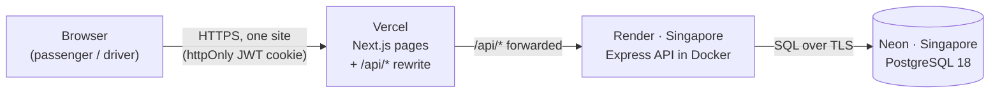

# Deployment

Live since 2026-09-29, on free plans only (PRD Section 6: "free/free-tier only, do not pay").

| Part | Host | Address |
|---|---|---|
| App (open this one) | Vercel, Hobby plan | https://dhaka-tesla-pool-beta.vercel.app |
| API | Render, free web service | https://dhaka-tesla-pool-api-pdi0.onrender.com (health check: `/health`) |
| Database | Neon, free plan | not public |

Demo logins are the same as locally: `jashim@teslapool.test` (driver) or `nusrat@teslapool.test` (passenger), password `bullet123`.

## How the parts connect



The same shape as `docker compose` (see [architecture.md](architecture.md)), with three hosts instead of three containers. The browser only talks to Vercel, so the login cookie is first-party and no CORS is needed. The API and the database sit in the same region, so every query is a short hop.

## Why these hosts

PRD Section 7 asks for the alternatives, why the choice fits, and what would make me switch.

| Part | Picked | Realistic alternatives | Why it fits this MVP | Switch when |
|---|---|---|---|---|
| Database | Neon | Render's free Postgres; my Azure student Postgres | It has Postgres 18, which the first migration needs (`uuidv7()`). No card needed. Render's free databases expire 30 days after creation, which would be during grading. My Azure server is already used by another project. | The free limits run out (100 CU-hours and 0.5 GB), or the database must never sleep. |
| API | Render | Azure Container Apps; Express as Vercel functions | It runs our `backend/Dockerfile` unchanged and builds straight from GitHub. The server is long-running on purpose: it migrates the database and builds the road graph once at startup, then keeps a connection pool. Functions start and stop on demand, so that startup work would repeat in every new copy. | Cold starts start to hurt real users, or one instance is not enough: a paid instance that never sleeps, or a container platform with autoscaling. |
| Frontend | Vercel | Render (it would sleep too); Netlify | Made by the Next.js team, so Next.js 16 builds with almost no setup. A preview link for every branch. | Commercial use (the Hobby plan is non-commercial only), or wanting everything on one host. |

## Settings

Nothing secret is in git. The two secrets, `DATABASE_URL` and `JWT_SECRET`, live only in Render's settings.

### Neon (database)

- Postgres **18**, region AWS Singapore (`ap-southeast-1`), free plan.
- Connection string: the **direct** one (connection pooling off), with `sslmode=verify-full`.
  - Direct, because the backend is one long-running server that also runs migrations. Neon's pooler is meant for serverless apps with many short connections.
  - `verify-full` checks the server's certificate fully. `pg` already treats `require` the same way, but prints a security warning at every start.
- Optional: cap the compute size at 0.25 CU (Branches → production → Computes → Edit), so the free hours can't burn faster.

### Render (API)

| Setting | Value |
|---|---|
| Service | Web Service, language **Docker** |
| Branch | **`pre-release`** (switch to `release/v1.0.0` once it is cut) |
| Root directory | `backend` (Dockerfile path `./Dockerfile`) |
| Region / instance | Singapore / **Free** (0.1 CPU, 512 MB) |
| Environment | `DATABASE_URL` = the Neon string. `JWT_SECRET` = 64 random hex characters from `node -e "console.log(require('crypto').randomBytes(32).toString('hex'))"`, different from the local one. |
| Health check path | **empty**, on purpose (see [Free-plan limits](#free-plan-limits)) |
| Auto-deploy | On commit |

`NODE_ENV=production` comes from the Dockerfile; it turns on the cookie's `Secure` flag. Render sets `PORT`, and the server reads it. On every start the server applies pending migrations (tables and the Dhaka map) and builds the road graph. The log then shows `Database migrations applied` and `Dhaka map loaded`.

### Vercel (frontend)

| Setting | Value |
|---|---|
| Root directory | `frontend` (framework Next.js) |
| Production branch | **`pre-release`** (switch to `release/v1.0.0` once it is cut) |
| Environment | `BACKEND_URL` = `https://dhaka-tesla-pool-api-pdi0.onrender.com` (no trailing slash) |
| Install command | `npx pnpm@12.4.2 install --frozen-lockfile` |
| Build command | `npx pnpm@12.4.2 run build` |

`BACKEND_URL` is read when Next.js **builds** (the `/api/*` rewrite in `next.config.ts`), so changing it needs a redeploy. The install and build commands pin pnpm; see [What went wrong](#what-went-wrong).

### Demo data

The app never seeds itself. The demo cast was added once from a laptop, with the seed pointed at Neon:

```bash
cd backend
DATABASE_URL='<neon connection string>' pnpm db:seed
```

In PowerShell: `$env:DATABASE_URL='<neon connection string>'; pnpm db:seed`. A variable set in the shell wins over the one in `../.env`. The seed is safe to run again: it keeps rows that already exist.

## History (2026-09-29)

1. **Neon:** created the project. `select version()` answered PostgreSQL 18.6, and `uuidv7()` worked.
2. **Render:** first deploy. On startup the backend created every table and the Dhaka map in Neon.
3. **Seed:** ran `pnpm db:seed` against Neon: 12 areas, 22 roads, 5 users, 2 cars.
4. **Vercel:** the first build failed; the second passed (see below).
5. **Smoke test** on the live address: 16 of 16 checks passed.
6. **Keep-warm ping** (evening): the API got a database-free `GET /`, and a cron-job.org job calls it every 10 minutes (see [Free-plan limits](#free-plan-limits)). The smoke test passed again, 16 of 16, and left a second completed ride.

### What went wrong

- **Vercel used a very old pnpm.** It ignored `packageManager` in `frontend/package.json` (its Corepack step reported the field as missing) and guessed the pnpm version from the lockfile instead. pnpm 12 writes the lockfile as two YAML documents, which older pnpm versions can't read, so Vercel picked an old pnpm that also fails on Node 24 (`ERR_INVALID_THIS`). Fix: install and build commands that run exactly pnpm 12.4.2, the same version as the laptop and the Dockerfiles.
- **The first visit after the API slept looked broken.** Render answered 502 while waking up, and the app showed the user as logged out, then "Can't reach the server" on login. Fix: the frontend retries 502/503/504 for up to 90 seconds with a "Waking up the free server" notice. It was tested against a fake backend that answers 502 for its first 10 seconds.
- **The claude.ai Vercel connector could not create the project** (Vercel answered 403). The project was created with the Vercel CLI instead. Details in [ai-usage.md](ai-usage.md).

### Smoke test

Every request went through the Vercel address, so each one took the real path: browser → Vercel → Render → Neon.

- The home page is public (200). `/api/auth/me` without a cookie gets the backend's 401, so the rewrite works.
- Nusrat logs in. The cookie is `HttpOnly`, `Secure` and `SameSite=Lax`. Login took about 2.5 s.
- 12 areas. The quote for Banani → Mohakhali, 1 seat, is **50.88 Tk**.
- Nusrat books. Jashim goes online and accepts. Rafiq books Banani → Gulshan 1 and joins the same ride.
- Arrive, start, complete. Jashim's history shows 2 passengers and **102.72 Tk** cash, and both passengers see the ride as completed.

This left one completed ride in the live database. Jashim was set back offline.

## Free-plan limits

- **The API would sleep** after 15 minutes without visitors; the keep-warm ping below stops that. If it sleeps anyway (the ping fails, or Render restarts it), Render answers 502 at once while it wakes (about a minute). The app retries every 3 seconds for up to 90 seconds and shows "Waking up the free server" meanwhile (`frontend/lib/api.ts`).
- **The database sleeps** after 5 idle minutes and wakes in about a second. The free plan has 100 CU-hours (compute-unit hours) a month, about 400 hours at the smallest size, and 0.5 GB of storage.
- **Keep-warm ping on `/`, never on `/health`.** cron-job.org (free) calls `GET https://dhaka-tesla-pool-api-pdi0.onrender.com/` every 10 minutes. `/` answers 200 without a query, so Neon still sleeps. Awake all month is at most 744 hours, inside Render's 750 free instance hours a month (counted per workspace; this is its only service).
  - Not `/health`: it runs a query, so Neon would never sleep and would use up its free hours in about 16 days. That is also why Render's own health check stays off.
  - Not `/api/auth/me`, which also skips the database but answers 401 without a cookie. cron-job.org marks non-2xx answers as failed and switches a job off after more than 25 failures in a row, so that ping would stop by itself within about 4 hours.
- **Login takes about 2.5 s** on the free 0.1 CPU. Password hashing (`scrypt`) is slow on purpose, and the settings are the same as locally.
- **Vercel's Hobby plan** is for non-commercial use only.

## Operating it

- **Deploy a change:** push to the tracked branch. Vercel rebuilds the frontend on every push. Render redeploys only when something under `backend/` changed. New migrations run by themselves when the backend starts.
- **Other branches** get a Vercel preview link. Previews ask for a Vercel login, and they use the same live API and database.
- **Check health:** `GET https://dhaka-tesla-pool-api-pdi0.onrender.com/health` answers `{"status":"ok","db":"up"}`. If the API is asleep, the first call takes about a minute.
- **Ping:** cron-job.org → the job → History shows every call; each should be 200. Pausing the job lets the API sleep again.
- **Logs:** Render dashboard → the service → Logs. The API logs one line per request (method, path, status, time), so the ping shows up as `GET / 200` every 10 minutes. Vercel dashboard → the project → Deployments.
- **Switch to a release:** after cutting `release/v1.0.0`, change the branch in both places (Render: Settings → Build & Deploy → Branch. Vercel: Settings → Environments → Production → Branch Tracking). Redeploy both, then repeat the smoke test.
- **Change a secret:** edit it in Render's Environment settings, and Render redeploys. A new `JWT_SECRET` logs everyone out, because old cookies stop verifying.
