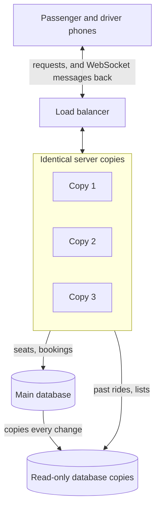

# If Oi Tesla goes viral

The PRD bonus asks: what changes at **1 million passengers and 100,000 drivers**? This is my reasoning. It is not built and not tested at that size; the MVP stays small on purpose. I kept to ideas I can explain and point at in our code.

## First, a quick calculation

At the busiest hour, guess **30,000 drivers** online and **50,000 passengers** with a ride open.

- The screens ask the server for news every 5 seconds (polling). The driver screen asks 3 things, the passenger screen 2:
  30,000 × 3 ÷ 5 + 50,000 × 2 ÷ 5 = 18,000 + 20,000 = **38,000 questions per second**. Almost every answer is "nothing changed".
- Bookings: if each passenger books once a day, and a tenth of the day's bookings happen in the busiest hour, that is 100,000 an hour, **about 28 per second**.

So the first problem is not booking. It is all the asking.

## The picture

## Ten changes

### 1. Tell, don't ask (real-time communication)

- **Today:** each screen asks "anything new?" every 5 seconds (polling). It is simple, and fine for now: a ride changes status only a few times.
- **At scale:** each phone keeps one connection open (a WebSocket). The server stays quiet until something changes, then sends one message, for example "your trip started". This removes most of the 38,000 questions per second. Polling stays as a backup for when the connection drops.

### 2. More servers (load balancing, horizontal scaling)

- **Today:** one backend server.
- **At scale:** many identical copies. A load balancer sits in front and sends each request to a free copy. This works because our server remembers nothing between requests: the login cookie says who the user is, and every copy has the same map.
- **Fix first:** every copy runs the database migrations when it starts (`server.ts`). With many copies, run migrations once, as a separate step before the new version goes out.

### 3. Database copies (read replicas)

- **Today:** one database does everything.
- **At scale:** add read-only copies. Past rides and lists are read from a copy. Seats and bookings always use the main database: a copy can be a second behind, and an old seat count could give the last seat to two people.

### 4. Remember what doesn't change (caching)

- **Today:** the 12 areas and 22 roads are read once at startup and kept in memory. No request reads the map from the database.
- **At scale:** the same idea for other data that rarely changes, like the list of areas. Never for seats or ride status: those must always be fresh.

### 5. Find rows fast, show them in pages (database indexing)

- **Today:** indexes on the columns our queries search, like the index at the back of a book: waiting requests by pickup area, past rides by owner and date. Lists show only the newest 50.
- **At scale:** paging. Show 50, and "load more" continues after the last one shown. Our ids (UUID v7) are in time order, so "continue after this id" works.

### 6. The last seat (database contention)

- **Today:** one SQL statement claims the seats: add them only if they still fit. The database locks just that one ride's row for a moment, and a CHECK constraint is the backstop.
- **At scale:** this keeps working. Each lock covers one car with 3 seats, so a thousand cars booking at the same time never wait for each other.

### 7. Limit the callers (rate limiting)

- **Today:** no limit (a known limitation).
- **At scale:** each user and each IP address gets a maximum number of requests per minute. Above it, the server answers 429 "Too many requests". Login gets the strictest limit: checking a password is slow on purpose, so a flood of logins would use up the CPU.

### 8. A ticket number for every tap (idempotency)

- **Today:** the database allows one active booking per passenger, so a double click books only once.
- **At scale:** mobile networks resend requests. The app sends a unique key with each action (an `Idempotency-Key` header). If the same key arrives twice, the server returns the first answer instead of doing the action again.

### 9. See what is happening (observability)

- **Today:** one log line per request (method, path, status, time taken), and every error.
- **At scale:** graphs of response times and errors, and alerts when they go bad, for example many "car is full" answers or slow bookings.

### 10. Security

- **Today:** slow password hashing (scrypt), a login cookie that page scripts can't read (httpOnly), the owner checked inside every query, every input validated (Zod), and the fare computed on the server.
- **At scale:** rate limits (point 7), short login tokens that can be cancelled (refresh tokens), and identity checks for drivers.

## What stays the same

- Postgres decides who gets a seat, with the one-statement claim and the CHECK behind it.
- Money in whole paisa, and the fare fixed at booking.
- Every status change written to `ride_events`.

## What I left out

The PRD also lists GPS-based matching, message queues, retry strategies and advanced deployment. I haven't worked with those yet, so I left them out instead of listing words I can't explain. They are what I would learn next.
